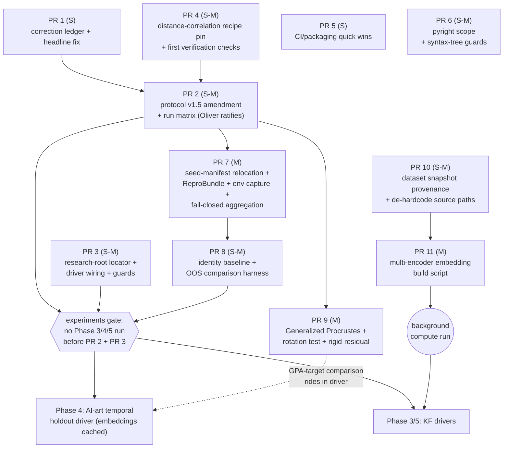

# REAP development roadmap — July 2026 execution plan

**Status:** Proposed (awaiting Oliver's ratification of the decision points in §7).
**Audited against:** `main` = `be9818d`, working tree clean, 2026-07-01.
**Test/health baseline at that commit:** full suite 714 passed / 21 skipped (2m03s);
`pyright` at its full configured scope = 19 errors, all in `tests/` (`src/reap/` is clean);
`ruff check src/ tests/` clean; `ruff check scripts/ examples/` = 13 errors;
`ruff format --check .` = 79 of 98 files would be reformatted.

**How this document was produced.** Every claim in the two existing planning documents
(`docs/dev_plan_revision_2026-07.md` and the phase plan it strengthens) was re-verified
against the repository at the commit above. The plan was then stress-tested from six angles —
pre-registration integrity, reproducibility, sequencing, solo-maintainer effort realism,
peer-review defensibility, and release safety — and every proposed change was adversarially
checked against the actual files and the project's settled constraints before being kept.
Changes that failed that check were dropped and are listed in §6, so this review is honest in
both directions. Where this document conflicts with the July revision doc, this document wins;
everything it does not mention carries over unchanged.

**The bottom line.** The plan's architecture survived the stress-test: shared infrastructure
before experiment drivers, the protocol amendment gating all experiments, the release path
staying disabled, the two-stage research-repo split, and the statistics toolkit are all right
and are re-affirmed (§5.10). What changed: two publication-integrity problems were found that
outrank everything currently queued (§2.1, §2.2), the protocol amendment needs a wider scope and
an earlier ratification point (§2.3), several already-landed items must be marked done so they
are not re-executed (§5.1), a handful of sequencing corrections were needed (§5), and the whole
backlog is packaged into eleven bounded pull requests (§3) so a solo maintainer can execute it
one review cycle at a time.

---

## 1. Where the repository stands (verified 2026-07-01)

**Landed and confirmed working — do not re-implement:**

- `LinearProjectionHead` + the head-factory refactor of `train_projection_head`
  (`src/reap/projection.py:163`, `:248`), with the projection head public in `__all__`
  (88 exported names, including all four projection names).
- Reproducible-by-default seeding: `seed: int | None = 42` (`projection.py:247`), per-fold
  seed derivation (`seed + fold` at `:313-314`, `seed + n_folds` at `:398-399`), and the
  reported-metric clustering isolated from the model seed
  (`_METRIC_KMEANS_RANDOM_STATE = 42`, `projection.py:32`). Same-seed reproducibility tests
  exist (`tests/test_projection.py:283-340`).
- The release path is triple-disabled (`Private :: Do Not Upload` classifier at
  `pyproject.toml:30`; `release.yml` builds, verifies, then fails a loud guard with no
  publish step and no OIDC token).
- Core/datasets boundary is clean today: no `src/reap/*.py` module imports a specific
  dataset module (checked at the syntax-tree level; the mechanical guard for it is queued
  in PR 5).
- The statistics the protocol pre-registers all exist and are tested
  (`paired_wilcoxon`, `holm_bonferroni`, `paired_cohens_d`, bootstrap CIs in
  `src/reap/statistics.py`).

**Absent, exactly as the plan says — the Phase 2 queue is real:**
identity (nearest-reference) baseline; Generalized Procrustes; the versioned `bundle.json`
record-file schema; the distance-correlation verification tests; the direct
rotation/reflection-invariance test; the unified out-of-sample (OOS) comparison harness;
`src/reap/py.typed`; any committed environment capture (no `environment.yml`, no lockfile);
all of the planned mechanical guard tests.

**Broken or contradictory — found by this audit, addressed in §2:**

1. The public headline number is misattributed and contradicted by the repo's own
   verification (§2.1).
2. New experiment results have no committed home — the ignore policy predates the
   research-repo split that was supposed to absorb it (§2.2).
3. The pre-registered acceptance rule cannot be evaluated as written, and several
   pre-registration gaps are one experiment run away from becoming permanent (§2.3).
4. Smaller shipped-text defects: the torch install hint names a nonexistent package
   `reap-embeddings[projection]` (`src/reap/projection.py:45`; the package is
   `reap-topics`); `CONTRIBUTING.md` points contributors to `.claude/rules/` as the
   "binding source of truth" at three places (lines 7, 61, 78) but that directory is
   local-only, so an external contributor gets dead links; the `Typing :: Typed`
   classifier is declared but `src/reap/py.typed` does not exist.

---

## 2. Three problems that outrank the current queue

### 2.1 Fix the public headline number and create the tracked correction ledger — now

**The problem.** `README.md:9-11` says the +32% ARI improvement (0.75 vs. 0.56) was achieved
"on the AI-art discourse corpus". The repo's own results file
(`manuscript/key_validated_results.md:34`) places that identical row under **Korean forest
policy**, and the tracked verification log (`docs/verification/ari_ladder_log.md:399`)
concludes that quoting 0.75/0.758 at all, without its exact definition, "is incorrect": the
independently re-derived Korean-forest consensus-vs-expert ARI is **0.122634** (consensus
K=23 against 20 ground-truth classes); the 0.75 figure comes from the sibling project under a
definitionally different calculation (different label set, different K, different subset).
The same stale numbers are hardcoded in shipped docstrings (`src/reap/consensus.py:9` and
`:206`). Meanwhile the "pending corrections" lists that are supposed to catch this at
manuscript unfreeze live only in local, untracked working files — invisible to anyone else
and to any future clone.

README and code docstrings are **not** frozen manuscript prose, so leaving a number the repo
itself has falsified on the package's front page is a standing zero-fabrication violation
with no freeze protection to excuse it. This is also the time-sensitive item: the same
number's definition must be confirmed for Hye In's Korean-forest manuscript **before she
submits**.

**The fix (PR 1, small, docs + two docstrings):**

1. Create **`docs/PENDING_PROSE_CORRECTIONS.md`** — the durable, tracked correction ledger.
   One entry per frozen claim: the claim text and its locations, the correct value, and the
   committed source artifact. Seed it with, in order:
   - **Korean-forest ARI headline** — claim "ARI 0.75, +32% over Procrustes 0.56" at
     `README.md:11`, `manuscript/sections/introduction.md:40,51`,
     `manuscript/key_validated_results.md:34`, `src/reap/consensus.py:9,206`; verified value
     0.122634 consensus-vs-expert (consensus K=23 vs 20 ground-truth classes); source
     `docs/verification/ari_ladder_log.md` ("Adjudication" section, resolution at line
     ~399). Note the arithmetic nit as well: 0.75 vs 0.56 is +33.9%, not +32%.
   - Lovato transparency = **80.95%** (204/252), never "~85%".
   - Country/Holm deviation: protocol pre-registered 10 demographic tests, code runs 9
     (Country dropped as all-USA) — the §19.a note lands via the protocol amendment (§2.3).
   - AI-art N = **1,736** on disk (loader fails closed on any other N); "1,742" survives
     only in stale prose (ladder-log line 374 and one test docstring).
   - Seed-manifest `high_exclusive` overflow (2147483648 → 2147483647), **plus** the same
     off-by-one in the generator that would re-write it
     (`manuscript/seeds/generate_seed_sets.py:144` writes `SEED_RANGE_HIGH + 1`).
   - A2 smoothing convention (`laplace_add_one`) + Wasserstein normalization to record in
     the cross-source artifact metadata.
2. In the same PR: rewrite `README.md:9-11` to a provenance-safe claim (either drop the
   number or state 0.122634 with its exact definition and dataset), fix the dataset
   attribution, and strip or requalify the "Validated: …" lines in
   `src/reap/consensus.py:9` and `:206`. Note both edits in `CHANGELOG.md` under
   `[Unreleased]`.
3. Offline (not a repo change, but the deadline-bearing step): Oliver confirms which ARI
   definition Hye In's manuscript quotes, against the ladder log's recipe, before she
   submits.

The frozen manuscript sections keep their wrong numbers for now — that is what the freeze
means — but every one of them is now ledgered in a tracked file, so nothing can be silently
dropped at unfreeze.

### 2.2 Give new results a committed home — before any experiment driver runs

**The problem.** The May 2026 separation policy ignores `manuscript/`, `docs/verification/`,
and `results/` wholesale (`.gitignore:72-74`) in anticipation of a "REAP-research" sibling
repository — which did not exist at audit time. Consequence: every `bundle.json`, every combined CSV,
and the planned results tables the Phase 3–5 experiments would produce **land untracked by
default**. This has already happened once: the 20-newsgroups OOS-bridge experiment's result
CSVs (per-document metrics, class summaries, cluster-class matrices), the between-set
reliability and pairwise-test CSVs, and the common-space silhouette CSV exist only as
untracked files on one machine, written by scripts that record no provenance (no commit, no
seeds, no config). Roughly 870 files sit on disk under `results/` versus ~300 tracked. Every
reproducibility guard the plan builds (record files, fail-closed aggregation, the
prose-number-to-artifact check) binds numbers to **committed** files; with the current ignore
policy the plan could execute perfectly and every paper number would still trace to a
local-only file. A single disk failure converts a small `git add` into a full re-run of a
headline experiment.

**The fix — RESOLVED: the sibling-repository option was selected and executed.** The
**REAP-research** sibling repository now exists (scaffolded 2026-07-02, awaiting the initial
commit) as the committed, track-by-default home for every number-bearing artifact: full
design, boundary rules, and Stage A import record in
`docs/reap_research_split_plan_2026-07.md`. The previously untracked number-bearing files
were imported there wholesale — 567 files, 26.1 MB, per-file SHA-256 manifest: the 375
gitignored CSV/JSON files under `results/`, the 186 binary arrays verification re-derives
from plus 3 saved projection-head weight files, and 3 gitignored research-prose documents
that committed text cites (the 2026-05-21 pre-registration proposal and two verification
logs). Excluded: the 9 consensus distance matrices (~105 MB — recomputable only by
re-running the pipeline from the dataset snapshot and seed manifest). This repo's
`.gitignore` stays as-is: already-tracked files are unaffected, and new writes (results,
tables, **and figures**) go to the sibling.

**PR 3 therefore becomes the write-target wiring (small-medium):**

1. **Locator helper** under `scripts/` (never `src/reap/` — the core stays
   research-agnostic): `get_research_root()` resolving `REAP_RESEARCH_ROOT` env var →
   `../REAP-research` sibling → **raise** with a clear message naming the env var.
   Unit-tested (env set; env unset + sibling present; neither → raises).
2. **Driver wiring:** result-writing scripts gain `--research-root` defaulting to the
   locator; new Phase 3–5 drivers are written against it from day one; legacy scripts are
   re-pointed as they are retrofitted in PR 7.
3. **Guard test:** the locator fails closed, plus a **working-machine** check that no *new*
   gitignored number-bearing file accumulates under this repo's `results/` beyond the
   Stage A import baseline (that would mean a writer bypassed the contract) — baseline =
   the import manifest resolved through the locator; comparison by SHA-256 so changed
   files are flagged, not just new paths; skips with a visible reason in CI, where a fresh
   checkout has no ignored files and no sibling. The artifact-tracked-and-checksummed
   guard runs on the REAP-research side against its migration manifests.

This PR still gates Phases 3–5: no experiment driver runs until it writes through the
locator.

### 2.3 One consolidated protocol amendment (v1.5), wider scope, ratified at the start of Phase 2

**The problem.** The evaluation protocol (v1.4, frozen) has pre-registration defects beyond
the seven the July revision already lists, and some are live:

- **The acceptance rule cannot be evaluated as written.** §18.h requires "at least 3 of 6
  strategies" per corpus, but AI-art has five strategies (§18.b) — the rule is arithmetically
  inapplicable to one of the two corpora.
- **A qualifier was silently dropped.** The authoritative proposal reads "trustworthiness
  **CV** mean > 0.70"; §18.h says "trustworthiness mean > 0.70". Whether a
  cross-validation number or an (optimistic) final-fit number satisfies the floor is exactly
  the distinction the project's honest-reporting rules exist to pin down.
- **The rule rewards the model's own training objective.** §18.h lets REAP pass by
  significantly beating both the parametric-UMAP baseline and the linear head on *either*
  trustworthiness *or* distance correlation — but distance correlation is the very quantity
  REAP's projection heads are trained to maximize, and the parametric-UMAP baseline is not. A cross-method win on your own loss function is the first thing a
  methods reviewer strikes. (MLP-vs-linear head comparisons on that metric stay fair — both
  heads train on the same loss.)
- **The multiple-comparison family is defined three inconsistent ways.** §8 says the family
  is ~5 tests per dataset per metric; §18.g says 216 total per corpus; the proposal derives
  108 via "3 baselines × 6 metrics × 6 strategies" — which matches neither the 5-strategy
  AI-art design nor the ×3-encoder Korean-forest design. The Holm-corrected significance
  threshold changes by an order of magnitude depending on which family you pick, so
  "significant at Holm-corrected α=0.05" is currently unevaluable — and family-shoppable
  (one could pick whichever family definition makes a result look significant).
- **A live, silent deviation.** §19.a pre-registers 10 demographic tests (Holm m=10); the
  committed analysis code runs 9 (Country excluded as all-USA). The protocol's own §13
  procedure requires a version bump + changelog entry for that — months overdue.
- **"Distance correlation" is undefined and ambiguous.** Both uses of the name ask the same
  plain question — how well are point-to-point distances preserved? — but the code answers it
  two subtly different ways under one name, and the protocol sets thresholds on the name: the
  reported metric is the Pearson correlation of condensed pairwise-distance vectors
  (`evaluation.py:163-190`), while the training loss re-implements it over the full flattened
  distance matrix — diagonal included, every pair counted twice (`projection.py:211-221`).
  The two demonstrably disagree on identical inputs (the diagonal zeros do not cancel out of
  a Pearson correlation); the PR 4 parity test records the exact gap on a committed fixture.
  Neither is Székely's distance correlation, despite the standard name. This is the same
  one-name-covering-two-calculations failure mode that produced the Korean-forest ARI
  confusion.
- **No dependence-unit rule for the random holdouts.** AI-art rows are 250-word chunks of
  longer documents; the random split strategies stratify by year only, so chunks of the same
  document can land on both sides of the split, inflating every OOS metric. No grouping,
  duplicate, or leakage rule is pre-registered anywhere.
- Plus the seven gaps the July revision already lists (run-matrix enumeration with
  primary/secondary marking, encoder-combining rule, identity-baseline reporting role,
  threshold provenance, null-result path, minimum fold size, per-corpus strategy counts).

**The fix (PR 2 drafts + Oliver ratifies; one amendment, one commit, one changelog entry):**

Draft **`docs/proposals/2026-07-protocol-v1.5-amendment.md`** now (mirroring how v1.4 was
ratified from an authoritative proposal doc — but note the home: **new** files under
`manuscript/` are gitignored, so a draft placed beside the v1.4 proposal could never be
committed; protocol companions that must be committed live under `docs/`, which stays
tracked through the research-repo split) and have Oliver ratify it **at the start of
Phase 2** — it is pure paperwork with zero compute, and ratifying first means the Phase 2
code (record-file schema, identity baseline, metric recipe names, Procrustes-variant
designation) is built to match ratified text instead of the reverse. The existing hard
backstop stays: **no Phase 3/4/5 experiment runs before the amendment lands.** One
sequencing exception, stated explicitly: the amendment's metric-recipe wording depends on
the distance-correlation recipe pinning (PR 4), so ratification follows that one PR.

Amendment contents checklist (each item one short clause; §15 changelog entry covers all):

| # | Clause |
|---|--------|
| a | Per-corpus acceptance counts: 5 strategies (AI-art) / 18 evaluations (KF, 6 × 3 encoders) — replaces "3 of 6" |
| b | Restore the "CV mean" qualifier; require the record file's evaluation-mode field to match the number used |
| c | Designate trustworthiness (training-independent for all methods) the primary cross-method metric; distance-correlation cross-method comparisons labeled "training-objective-aligned, supporting"; head-vs-head comparisons on it stay primary |
| d | Define the Holm family exactly once; state corrected per-corpus family sizes; retire or re-derive the "216"; pin how the random-split strategy's three replicates enter the family (e.g., mean across replicates per seed); commit the full run enumeration as `docs/run_matrix_v1_5.json` (dataset × encoder × seed-set × strategy × baseline × metric, with primary/secondary marks — under `docs/` because new `manuscript/` files are gitignored, and the aggregator's CI test must read a tracked file that survives the repo split) + a test recomputing family sizes from it |
| e | Identity baseline: confirm family membership, add to primary reported comparisons (effect size + CI, no gate), pre-write the "REAP ≤ identity" null interpretation |
| f | Pre-register the dependence unit + near-duplicate leakage audit for random holdouts (group-aware splits if document ids are recoverable; otherwise a reported max-cosine-similarity audit, with the temporal strategies designated primary evidence); add the leakage objection + response to the §11 objection table |
| g | Pre-register the artist repeated-measures correction (artist-level aggregation or artist-permutation test; bootstrap CIs resample artists, not probes) — §13 deviation-correction linkage since per-probe results have already been produced (they exist only as local, untracked artifacts) |
| h | KF encoder-combining rule (report each separately; state it) and minimum fold size for KF holdouts |
| i | Threshold provenance notes: which bars come from theory / pilot / calibration / observed-with-headroom, labeling the last kind as sanity checks |
| j | Null/negative-result reporting path |
| k | §12 record-file fields += schema version, resolved versions of the number-moving libraries (umap-learn, scikit-learn, numpy, torch + BLAS backend), evaluation mode, run status + failure reason, metric-recipe ids, protocol version |
| l | §19.a Country/Holm m=10 → m=9 deviation note + changelog (closes the live §13 violation) |
| m | Distance-correlation recipe: name the reported metric's exact recipe ("Pearson r between condensed pairwise-distance vectors", explicitly *not* Székely dCorr, kind tag `adapted`); register the loss variant as a distinct named recipe |
| n | Procrustes: designate Generalized Procrustes the headline comparator; both variants reported; the pre-registered pairwise ranges stay untouched (the new method is additive) |
| o | Deferred-analyses decisions (§5.7) + the two stub dataset loaders, each with a one-line reason; deferred acceptance criteria marked deferred, not deleted |
| p | Residual-risk migration into §11/§18.i (§5.8): Set-A-only cross-source caveat, A2 Wasserstein axis caveat, artist non-independence caveat; plus the standing rule that any new caveat lands as a §11/§18.i amendment entry in the same PR as the run that surfaced it |

**Make the gate mechanical:** the record-file schema gets a required `protocol_version`
field and the aggregator refuses record files whose protocol version predates the amendment
(both ride in PR 7); each experiment driver asserts the protocol version is ≥ 1.5 at startup
(the assertion helper rides in PR 6). The gate binds result-generating drivers only — the
embedding rebuild is result-blind and may run before ratification.

---

## 3. The execution order — eleven pull requests

Each PR is independently green-able, TDD (tests in the same PR), lands via feature branch →
PR → CI watch → Oliver merges. Sizes: S ≈ one sitting, M ≈ one to two days.

*(Diagram source is this file; a rendered standalone copy lives at
`diagrams/dev_roadmap_2026-07_pr_sequence.html`.)*

**PR 1 — correction ledger + headline fix** (S, docs + two docstrings). Contents: §2.1.
Acceptance: `docs/PENDING_PROSE_CORRECTIONS.md` exists with the six seeded entries; README
carries no number that lacks a committed source; suite green (docstring edits are
behavior-neutral).

**PR 2 — protocol v1.5 amendment + machine-readable run matrix** (S–M, docs + one JSON +
one test). Contents: §2.3 checklist a–p; `docs/run_matrix_v1_5.json`;
`tests/test_run_matrix.py` recomputes per-corpus family sizes from the JSON and asserts they
equal the amendment's stated counts, and that every pre-registered scalar metric and baseline
appears exactly once per run cell. Ratification: Oliver, at the start of Phase 2 (after PR 4
merges, since clause (m) cites the pinned recipe verbatim).

**PR 3 — research-root locator + driver wiring + guards** (S–M). Contents: §2.2 as
resolved (the REAP-research sibling exists; this PR wires this repo's drivers to write
there fail-closed). Acceptance: the locator's three-way resolution is unit-tested; a
result-writing script invoked without any resolvable research root **raises** rather than
writing locally; the no-new-ignored-number-files baseline check passes; a fresh
`bundle.json`/CSV/TeX produced by a wired driver lands inside REAP-research where
`git status` sees it.

**PR 4 — distance-correlation recipe pinning + trimmed verification** (S–M). (A "rung"
below is one level of a metric's verification ladder — from a hand-checkable example up to
real corpora.) Add
`tests/verification/_reference_distance_correlation.py` implementing both recipes
independently; a parity test on one fixed embedding pair asserting and documenting their
exact numerical relationship (the double-counting cancels in a Pearson correlation; the
diagonal zeros do **not** — record the measured gap on the fixture); a byte-identical loss
regression test (fixed inputs → identical loss tensor) so no future refactor can silently
move the loss. **Do not unify the loss with the metric** — the loss numerics are frozen by
the byte-identical calibration constraint from the July seeding fix until the deferred
Linux-side recalibration; the two quantities get two registered names instead
(`dist_corr_loss`, full-matrix recipe; `distance_correlation`, condensed-vector recipe), a
docstring pass gives the reported metric its recipe id and an explicit "this is not Székely
distance correlation" note with kind tag `adapted`, and the record file stores the recipe id
per reported value. Verification tests: closed-form rung (hand-computable 4-point case) +
synthetic rung with documented tolerance, both in CI; the real-corpora rungs wait until the
artifact-dependent verification tests are portable. Acceptance: both recipes documented and
tested; loss regression test green; amendment clause (m) can cite the recipe verbatim.

**PR 5 — CI/packaging quick wins, one batch** (S). (1) `src/reap/py.typed` (empty marker);
(2) `permissions: {contents: read}` + `timeout-minutes` on the five PR workflows; (3) in
`build.yml` and mirrored into `release.yml`'s build job (publish guard untouched): clean-venv
`pip install dist/*.whl && python -c "import reap"` + assert `py.typed` ships in the wheel +
`tar -tzf` the sdist asserting no `manuscript/` or `results/` entries (defense-in-depth
against a version-dependent packaging default); (4) fix `src/reap/projection.py:45` →
`pip install reap-topics[projection]` + a unit test asserting the hint names the real
package; (5) test matrix: add 3.10 now; check `pip index versions numba umap-learn` for
3.13 wheels and add 3.13 if they exist, otherwise leave a dated comment; (6) `typecheck.yml`
installs `.[ci]` instead of `.[dev]` (keeps torch/tensorflow apart; verify pyright stays
green without tensorflow installed before merging). Acceptance: all nine CI jobs green,
wheel-install smoke passing, matrix backing the declared Python support.

**PR 6 — pyright scope + mechanical guards** (S–M). (1) Fix the 19 test-scope pyright
errors; switch the typecheck workflow to bare `pyright` (config scope: `src/reap` + `tests`);
delete the dead `[tool.pyright]` block in `pyproject.toml` (the checker reads
`pyrightconfig.json`; two configs is how drift starts). (2) Core/datasets import-boundary
guard: a syntax-tree test failing if any core module imports a specific dataset module.
(3) RNG-ownership guard (`tests/test_rng_ownership_guard.py`): (i) no call to
`train_projection_head` in `scripts/**` passes `seed=None` outside the three frozen legacy
callers (`run_projection_head_oos.py`, `run_ai_art_oos_demo.py`,
`experiments/run_20ng_oos_bridge.py`); (ii) an enumeration baseline of the ~12 existing
randomness call sites in `src/reap/` that fails when a **new** unregistered randomness site
appears, forcing the author to thread a seed or consciously register the site. (4) Amend the
seeding footgun note in the projection docstring/working notes: new callers must **not**
seed torch globally and pass `seed=None`; they pass an explicit integer seed.
(5) `protocol_version` startup assertion helper for future drivers. Acceptance: bare
`pyright` = 0 errors; guards red on planted violations, green on the tree.

**PR 7 — seed-manifest relocation + versioned record file + environment capture +
fail-closed aggregation core** (M). Ordering matters: the relocation is the opener so every
record file written afterward stores the packaged path.
(1) Move `manuscript/seeds/seed_manifest.json` + the datasets manifest into
`src/reap/datasets/data/`; update the four staying tests
(`test_golden_validation.py`, `test_projection_golden.py`, `test_labeling_golden.py`,
`test_visualization_and_reporting_e2e.py`), the three scripts that hardcode the manuscript
path (`run_paper_benchmark.py` — including its bundle-field literal —
`experiments/run_20ng_oos_bridge_pumap.py`, `experiments/run_phase0_diagnostic.py`), and the
stub-loader error string; add the files to the wheel include and a "moved files ship inside
wheel + sdist" assertion to the PR 5 smoke. Leave a one-line prose pointer in the plan at
the old location's documentation — not a compatibility copy under `manuscript/`, which would
die at the repo split.
(2) `ReproBundle` — a frozen Pydantic model, `schema_version` field, one-line description on
every field: commit SHA, generating script, dataset + SHA256, seed list + manifest pointer,
full config, python + platform, resolved versions of the number-moving libraries (+ the
BLAS backend — the low-level linear-algebra library, which can shift floating-point
results between machines), evaluation mode (`in_sample | cv | oos`), run status + failure reason,
`protocol_version`, metric-recipe ids. Written atomically (temp file, then rename).
Round-trip test + missing-required-field test.
(3) Retrofit every number-writing script, tiered: migrate `run_paper_benchmark.py`'s
informal in-script bundle writer to the shared `ReproBundle` model; full retrofit for the
zero-provenance scripts (`experiments/run_20ng_oos_bridge.py`, `…_pumap.py`,
`run_nn_centroid_oracle.py`, `run_phase0_diagnostic.py`,
`analysis/common_space_silhouette.py`, `run_ai_art_oos_demo.py`,
`run_cross_source_analyses.py`, and the two per-method runners that merge rows into the
combined comparison CSVs, `run_bertopic_only.py` and `run_parametric_umap_only.py`);
normalization for `run_projection_head_oos.py` (already records
commit/seed/config/SHA256s — route through the shared writer to gain the library-version
block). Each records the seed set it actually consumed, and each resolves its output root
through the PR 3 locator so nothing writes into this repo's ignored trees. Regenerate the un-provenanced historical trees by **re-running** the retrofitted
scripts (minutes of compute) — never backfill a bundle onto artifacts from an unknown commit.
(4) Backfill invalidation: `backfill_cv_coherence.py` must rewrite the sibling record file
(backfill commit, backfilled fields, prior-bundle hash) whenever it mutates a result file,
with a test asserting the bundle changes when the metrics file does; it also resolves its
result root through the PR 3 locator.
(5) Fail-closed aggregation core: the combining path derives the expected run grid from
`run_matrix_v1_5.json` and stops with a clear error on any missing or extra run. E2E test on
a tiny synthetic tree: passes complete, fails loudly on one-missing and one-extra.
(6) Commit `environment.yml` (the scientific environment: python + the number-moving
libraries), separate from the dev/CI lockfile question.
(7) Classify the 20NG result families (oos-bridge, nearest-centroid oracle, phase-0
diagnostic, common-space silhouette) as manuscript experiments (full record-file treatment)
or exploratory (marked as such, excluded from citable tables) — recorded in the amendment or
the ledger. Acceptance: schema tests green; every retrofitted script writes a valid bundle;
aggregator refuses incomplete grids.

**PR 8 — identity baseline + unified OOS comparison harness** (S–M). The identity baseline
(§18.d): nearest reference chunk in the **original embedding space** → copy its consensus
coordinate; pure numpy; same metric-dict shape as the trained heads. The harness:
`run_oos_baseline_comparison(...)` in `src/reap/` runs all three pre-registered baselines
(parametric UMAP, identity, linear) plus the REAP head on identical splits/seeds/metrics and
writes `comparison_metrics.json`; the harness is the identity baseline's first consumer, so
they ship together. Tests: harness smoke (one finite row per method on synthetic data);
fail-closed test (a missing baseline raises rather than writing a partial file). Acceptance:
one call produces the complete §18.f comparison artifact.

**PR 9 — Generalized Procrustes + rotation/reflection-invariance + rigid-residual
decomposition** (M; one `consensus.py` PR, off the drivers' critical path — none of §18.d's
OOS baselines depends on it).
(1) `get_generalized_procrustes_consensus` as a **new** function (iterative align-to-mean,
documented convergence tolerance) + new benchmark key `procrustes_gpa` alongside
`procrustes` — never replacing it: the golden-fixture margin was calibrated against the
pairwise implementation, and pre-registered ranges do not move (amendment clause n covers
the designation).
(2) Tests: GPA seed-order invariance asserted on the **consensus distance matrix** (GPA
coordinates are only unique up to a global rotation); convergence on rotated copies;
existing property tests (symmetry / zero diagonal / non-negativity) parameterized over both
variants.
(3) Rotation/reflection-invariance test: apply seeded random orthogonal transforms +
reflections + translations per seed layout; assert the consensus distance matrix is
unchanged (documented tolerance ~1e-10 — pairwise distances are exactly isometry-invariant
up to float error) and downstream cluster labels identical, clustering the distance matrix
directly rather than through a second UMAP pass.
(4) Honest contrast tests (these define what the paper may claim): naive coordinate
averaging is **not** invariant to per-seed orthogonal transforms; pairwise Procrustes
consensus **is** invariant to them (to float precision — the test pins this; do not claim
otherwise in prose) but **is** seed-order/reference dependent (it aligns everything to
whichever seed comes first — the permutation test pins the size of that effect), while
REAP's distance consensus and GPA (within its convergence tolerance) are order-invariant. Paper text attributes Procrustes's
deficiency to non-rigid seed variation and reference dependence — not to rotation
non-invariance.
(5) `compute_rigid_residual_decomposition(umap_embeddings)` in `consensus.py`: the share of
seed-to-seed layout variation that alignment cannot remove. Concretely: per-seed disparity
to the GPA mean shape, plus the non-rigid residual fraction computed in **coordinate space**
(sum of squared deviations of GPA-aligned layouts from the mean shape over the total after
centering/scale-normalization — a distance-matrix-variance ratio is trivially 1 because
rigid transforms preserve distances). This is the actual empirical
evidence for "Procrustes alignment is insufficient": if seed variability were mostly rigid,
alignment would suffice; measuring the non-rigid remainder converts the paper's central
claim from an outcome (one ARI delta) into a mechanism with a figure. Registered as
descriptive (non-gated) in the amendment, which also pre-declares its seed-set scope (Set A
only — an explicit, stated deviation from the protocol's all-three-sets default — or all
three sets; pick one in the amendment, not after results exist); runs inside the Phase 4/5
drivers on the three working corpora; tests: pure-rotation copies → residual ≈ 0, genuinely
different layouts → residual > 0, order-permutation invariance.

**PR 10 — dataset snapshot provenance + de-hardcode source paths** (S–M; must precede
PR 11's expensive compute).
(1) Add optional typed fields to `DatasetMetadata` (`source_repo_commit`, `built_at`,
`raw_input_sha256`, `builder_script`; introduce a snapshot `schema_version`), populated by
all four sibling-repo-sourced builders; existing cached snapshots keep loading (fields
None); fail-closed applies at the paper-path consumer, not generic load.
(2) Replace the two hardcoded absolute sibling-repo paths in `run_ai_art_oos_demo.py` and
`run_cross_source_analyses.py` with a `--source-root` flag / env var (mirroring
`build_datasets.py --source-path`).
(3) Tests: schema round-trip; freshly built tiny snapshot carries non-empty provenance;
pre-provenance snapshot still loads.

**PR 11 — multi-encoder embedding build script** (M authoring + long background compute).
`scripts/build_kf_multiencoder_embeddings.py` per the existing plan (905 KF reference +
1,662 pledge sentences × mpnet-768 and multilingual-E5-large-1024 with the `query: ` prefix),
now populating the PR 10 provenance fields from day one; parity/round-trip test. The compute
run launches in the background alongside PRs 7–9 — it is result-blind, so it does not wait
for the amendment gate.

**After PR 8 + the gate (PRs 2, 3):** the Phase 4 AI-art temporal-holdout driver starts
(embeddings already cached), then the KF drivers when PR 11's compute lands — per the
existing plan, with these driver-spec addenda: drivers pass an explicit integer seed (never
`seed=None`), assert protocol version at startup, write the leakage-audit artifact (clause
f), include the GPA-target head comparison on at least the AI-art corpus (train the same MLP
head to the GPA-consensus coordinates for at least one temporal and one random strategy,
reported as a supporting comparison — it answers "why not just project into the Procrustes
space?"), and emit the rigid-residual decomposition. Each driver + the aggregator gets the
already-planned tiny end-to-end test (split coverage/disjointness, all baselines present,
valid record file, known-answer scoring).

**Scheduled later, now on the record:** a seed-count ablation driver
(`scripts/run_seed_ablation.py`, Phase 5/6): give `run_seed_ablation` an optional
pre-declared `seeds` list parameter (protocol requires manifest seeds; the current function
self-generates), run seed counts {2, 5, 10, 20, 30} as prefixes of Set A on AI-art + KF,
anchor n=1 with the existing single-seed benchmark method, one bundle-carrying CSV + one
committed figure. Registered as descriptive in the amendment. "Why 30 seeds?" is a
guaranteed reviewer question, and the library code already exists (`src/reap/ablation.py`).

---

## 4. Standing practices for all of the above

- **TDD; feature branch → PR → watch CI green → Oliver merges.** No version bumps pre-v1.
- **Fail closed on any paper-number path** (missing input/run/field ⇒ raise); soft-fail is
  acceptable only off the results path.
- **Every reported metric carries its exact recipe** (variant, pairing, K rule, tolerance
  with a stated reason) and a kind tag (`measured` / `adapted` / `external-reference`).
- **Randomness is owned**: explicit seeds or generators passed as arguments; per-step seeds
  derived from a base seed; no global RNG mutation on the results path (the PR 6 guard
  enforces the boundary).
- **Atomic writes** (temp file + rename) for every record/result file.
- **Every number in committed text traces to a committed artifact** — the widened
  prose-number guard (§5.6) enforces this mechanically; until it lands, PR authors check by
  hand.
- **Protocol changes only via amendment** (version bump + changelog + TRACE note). Frozen
  manuscript prose stays frozen; corrections go to the ledger.
- **Writing register**: plain language, technical terms explained, numbers exact
  (`docs/dev_plan_revision_2026-07.md` is the register model).

---

## 5. Corrections to the existing plan documents (bookkeeping, no compute)

1. **Mark done** (so no future session re-executes them): LinearProjectionHead +
   head-factory; seed threading + same-seed reproducibility tests; projection head public in
   `__all__`; metric-clustering RNG isolation; per-fold seed derivation. The July
   revision doc's Theme 8 items are landed
   except two that stay deferred — the Linux-side golden-threshold recalibration **and** the
   explicit re-seeding of the three frozen legacy callers that still pass `seed=None` after
   seeding torch globally — both made safe to defer by the PR 6 containment guard.
2. **Do not cut the two experiment branches yet.** Neither exists; all Phase 2 infra lands
   as short-lived PRs to `main`. Cut `feature/oos-temporal-holdouts` when the Phase 4 driver
   work starts, and `feature/kf-cross-origin` when the multi-encoder embeddings land —
   cutting them weeks early only buys rebase churn.
3. **Finish the git hygiene** (Oliver, five minutes): `git remote set-head origin -a &&
   git fetch --prune` (the local `origin/HEAD` symref still points at the old default
   branch, which is what makes tooling mis-target PRs); then delete the three merged
   branches local + remote after `git branch --merged main` confirms each.
4. **Repo-wide format normalization (79 files)**: land it as one isolated commit + a
   `ruff format --check` gate in lint CI **before** any long-lived experiment branch exists
   (the window is open now), or defer it until after those branches merge — never in
   between. Recommended: land it now, right after PR 5.
5. **Release-path re-sequencing**: add the named blocker "register the PyPI trusted
   publisher for `reap-topics` before the first release tag" to the release-enablement
   phase; annotate the GitHub-environment protection item "requires public repo or paid
   plan — sequence at the public flip; the re-enable PR must not merge before this rule is
   verifiably active"; move SHA-pinning of the publish action + Dependabot into the
   re-enable PR's own checklist (tag-pinned GitHub-owned actions in PR workflows can wait);
   write the re-enable PR at flip time from the recipe already documented in `release.yml`'s
   header instead of letting a drafted PR rot open for months.
6. **Widen the prose-number-to-artifact guard** (when it lands, per the July revision's
   Theme 3): gating tier = `README.md`, `manuscript/key_validated_results.md`, and
   `src/reap/` docstrings — every decimal metric needs a committed-artifact reference
   (which may resolve into the REAP-research sibling via the PR 3 locator), and the same
   value may not be attributed to different datasets in different files. New table CSVs
   live in the sibling's `manuscript/tables/` and are covered there by its own
   number-tracing review; report-only tier = `manuscript/sections/*.md` (frozen), where
   a finding fails the build only if it is missing from the correction ledger; each ledger
   entry's cited artifact must exist. The sections tier flips to gating at unfreeze.
7. **Deferred-analyses decisions to record in the amendment** (clause o): the
   topic-attribution rubric study (note: the judging core already exists as
   `src/reap/topic_attribution.py`; remaining work is a driver, the second judge, the
   agreement statistic, tests, and the judged runs — a genuine medium-sized phase, and
   deferring it defers the independent semantic validation of the OOS-bridge claim; state
   that cost honestly), the real-data OOS-filter re-run, the encoder-sensitivity study, and
   the two stub dataset loaders. Recommendation: defer all, with reasons, revisitable after
   the temporal-holdout program.
8. **Threats-to-validity**: do **not** create a parallel dossier file — the protocol's §11
   objection table + §18.i is the established, pre-registered home and already has the
   incremental-append pattern. Migrate the residual risks that currently live only in local
   notes (Set-A-only cross-source verification; A2 Wasserstein-on-nominal-axis caveat;
   artist non-independence) into §11/§18.i via the amendment (clause p), each entry carrying
   a status (mitigated / open / accepted-limitation) and its mitigation-artifact path, and
   adopt the standing rule that new caveats land there in the same PR as the run that
   surfaced them.
9. **Repair the contributor-facing standards links before the public flip.**
   `CONTRIBUTING.md` references `.claude/rules/` at three places (lines 7, 61, 78) as the
   binding source of truth, but that directory is local-only, so an external contributor
   gets dead links and none of the binding standards. Remedy: either commit a public,
   self-contained standards doc (e.g., `docs/development-standards.md` distilling code
   style, testing requirements, the check commands, and the public-API contract) and point
   all three sites at it, or inline the essentials into `CONTRIBUTING.md` and delete the
   links. Cheap enough to ride along with PR 1's docs batch; hard deadline is the public
   flip.
10. **Re-affirmed as-is** (each was checked against the six review criteria named in the
    header and none failed; do not relitigate): the
    report-don't-gate comparison framing; full run-matrix enumeration with primary/secondary
    marking; the paired-Wilcoxon/Holm/Cohen's-d/bootstrap machinery; the
    ladder-before-training rule for the distance-correlation metric; fail-closed aggregation;
    environment capture before experiments; the metric-RNG separation and per-fold seeding
    (landed); the Phase-2-before-drivers spine and the v1.5-before-experiments gate; the
    two-branch experiment structure (with deferred cuts); the two-stage repo split; the
    triple-disabled release path; and the do-not-adopt list (no uv, no workflow
    consolidation mid-experiment, no docs site pre-paper, no invariants registry ahead of
    mechanical guards).

---

## 6. Checked and dropped (honesty in both directions)

- **"Reconcile N=1,736 vs 1,742 before any driver runs, with a new guard test."** Dropped:
  the production arrays on disk are shape (1736,) (verified by loading them); the loader
  fails closed on any other N; sibling-repo parity tests already pin the count. "1,742"
  survives only in stale prose. The existing plan already schedules that prose fix at the
  right (low) priority; the ledger entry in PR 1 records it.
- **"Land the Set-D determinism guard before the manifest overflow edit."** Dropped: the
  guard test and that ordering are already in the plan (the guard is a Phase 2 item; the
  edit is a Phase 5 item that depends on Phase 4). The one useful residue — the manifest
  *generator* would re-write the off-by-one (`generate_seed_sets.py:144`) — is folded into
  the existing manifest-edit item via the PR 1 ledger entry.
- The July revision's own "Checked and dropped" list was spot-verified and stands.

---

## 7. Decisions only Oliver can make

1. **Artifact-tracking policy (§2.2):** **RESOLVED** — the REAP-research sibling was
   selected and scaffolded (see `docs/reap_research_split_plan_2026-07.md`). Remaining:
   review the scaffold, make its initial commit, create the private GitHub remote. PR 3
   (write-target wiring) still gates all experiment drivers.
2. **Ratify the v1.5 amendment at the start of Phase 2** (after PR 4), per §2.3 — confirm
   this timing, and ratify the amendment itself when drafted (clauses a–p, including the
   defer decisions in clause o and the GPA headline designation in clause n).
3. **Format normalization timing (§5.4):** land now (recommended) or after the experiment
   branches merge.
4. **Hye In's manuscript (time-sensitive, external):** confirm which ARI definition her
   manuscript quotes against the ladder log's recipe before she submits.
5. **License consistency — RESOLVED 2026-07-04: MIT.** The repo relicensed from Apache-2.0
   to MIT (LICENSE, `pyproject.toml` license field, classifier, README/CONTRIBUTING
   references, one PR), settling the earlier note's BSD-3-Clause-or-MIT question. Open
   follow-up: the REAP-research sibling still carries the Apache-2.0 copy from its Stage A
   scaffold — decide whether it follows (a research-artifact repo may want a data/document
   license instead of a code license).

---

*Companion documents: `docs/dev_plan_revision_2026-07.md` (the July revision this executes;
still authoritative for everything not amended here);
`docs/reap_research_split_plan_2026-07.md` (the REAP-research sibling design + Stage A
record, which resolves §2.2/§7.1 and reshapes PR 3); and
`docs/PENDING_PROSE_CORRECTIONS.md` (created by PR 1).*
