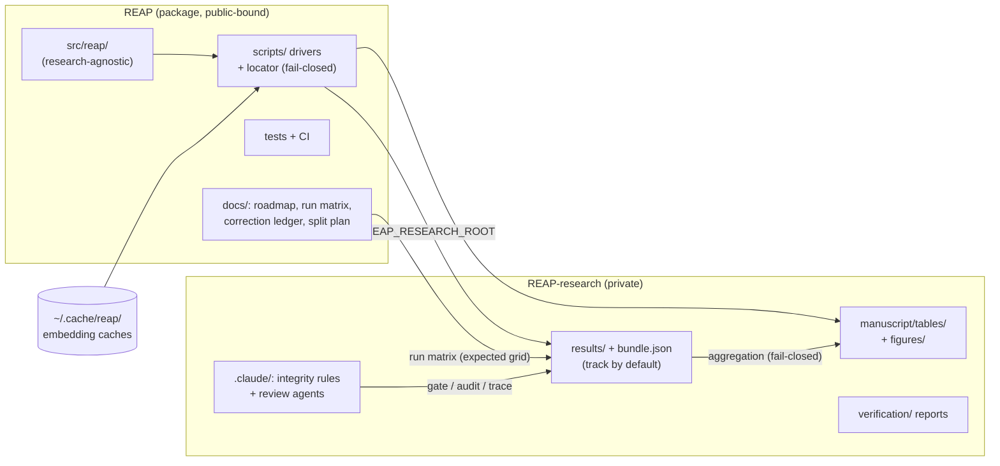

# REAP-research split plan — July 2026 (Stage A executed)

**Status:** Stage A scaffold built and awaiting Oliver's review + initial commit;
Stage B deferred as designed. This document is the durable record of the split's
design, what Stage A created, the cross-repository contracts, and what each side
still owes.
**Resolves:** the artifact-tracking policy decision in
`docs/dev_roadmap_2026-07.md` §7.1 — the sibling-repository option was selected
(create REAP-research now as the artifact write target; the destructive removal
of research files from REAP stays deferred). §2.2 and PR 3 of that roadmap are
amended accordingly (see §8 below).

---

## 1. Why this repository exists

REAP's ignore policy (May 2026) excludes `manuscript/`, `docs/verification/`,
and `results/` from the package repository, in anticipation of a research
sibling that did not yet exist. The consequence, verified during the July
roadmap audit: **567 number-bearing files existed only as gitignored files on
one machine** — the 20-newsgroups OOS-bridge experiment's result CSVs, the
cross-source analysis JSONs, and even three research-prose documents that
committed text cites (the 2026-05-21 temporal-holdout/cross-source
pre-registration proposal and two verification logs) — and every artifact the
planned temporal-holdout experiments would produce was headed the same way. A
result that lives only on one machine is not citable; a single disk failure
converts a small copy into a full experiment re-run.

REAP-research is the fix: the **committed home for every number that may
appear in the paper**, tracked by default, following the same sibling
convention already used elsewhere in the research directory (a code repository
plus a `-research` companion).

## 2. The boundary (what lives where)

| Concern | REAP (package repo, going public) | REAP-research (private) |
|---|---|---|
| Package code, `src/reap/` | ✅ | never |
| Package tests + CI + packaging | ✅ | never |
| Experiment **driver scripts** | ✅ `scripts/` (tested, CI-gated) | never — drivers *write here* |
| Result artifacts (new runs) | never (ignored) | ✅ `results/` |
| Result artifacts (pre-split, git-tracked) | ✅ until Stage B | Stage B |
| Manuscript prose / protocol / tracked proposals | ✅ until Stage B | Stage B (previously untracked proposal already imported) |
| New manuscript tables + figures | never (ignored) | ✅ `manuscript/tables/`, `manuscript/figures/` (+ `figures/src/`) — live now |
| Verification run logs | `docs/verification/` (tracked files) until Stage B | ✅ new reports in `verification/` |
| Correction ledger (`PENDING_PROSE_CORRECTIONS.md`) | ✅ `docs/` (survives the split) | referenced |
| Execution roadmap, run matrix, split plan | ✅ `docs/` | referenced |
| Development guidance (`.claude/`) | local-only (repo goes public) | ✅ **tracked** (private; canonical for research work) |
| Embedding caches | never | never (`~/.cache/reap/datasets/`) |

Two boundary invariants, stated once and enforced forever:

- **The `reap` package core stays research-agnostic** — nothing in
  `REAP/src/reap/` may know REAP-research exists.
- **Code changes never happen in REAP-research** — anything that changes how
  a number is computed goes through REAP's branch → PR → CI → merge.

## 3. Design decisions (with the reasoning)

1. **Location + name:** a sibling directory named `REAP-research` beside the
   REAP checkout (`../REAP-research`), the established pairing convention for
   code-repository/research-repository pairs.
2. **Fresh repository, no history surgery.** Imported files carry a
   checksummed manifest recording exactly what was copied and from what state
   — provenance by record, not by rewriting REAP's history. (The files were
   gitignored, so they have no REAP source commits to preserve.)
3. **Plain git, no LFS (for now).** After excluding the consensus distance
   matrices (9 files, ~105 MB — recomputable only by re-running the consensus
   pipeline from the dataset snapshot and the seed manifest, not from the
   imported arrays), the largest imported file is well under GitHub's limits
   and the whole import is 26.1 MB; large-file tooling would add setup cost
   for no current benefit. Trigger to revisit: any needed artifact over
   ~50 MB.
4. **`.claude/` is tracked in REAP-research.** REAP untracked its copy
   because that repository is headed for public release; the research repo is
   private and its guidance is the point. The research-repo copies of shared
   rules (`publication-standards.md`, `diagrams.md`) are canonical for
   research work; REAP's local copies mirror them.
5. **One TRACE project ("REAP") for both repositories.** The research program
   is one provenance stream — correction chains (e.g. the Korean-forest ARI
   headline) span both repos. Research-repo sessions carry a
   `repo:REAP-research` tag. The sibling's `CLAUDE.md` pins this with an
   explicit TRACE-project-name line, and REAP's TRACE session hooks are
   copied over so the reminder behavior is identical.
6. **Drivers stay in REAP; artifacts land here.** Driver scripts are real,
   tested code and belong under REAP's CI. They resolve the research root
   fail-closed: `REAP_RESEARCH_ROOT` env var, else the `../REAP-research`
   sibling directory, else **raise** (a paper-path driver must never fall
   back to writing untracked files). The locator helper lives under
   `REAP/scripts/` — not in the package — preserving the core's
   research-agnosticism.
7. **Stage A imports everything number-bearing, not a curated shortlist.**
   567 files, 26.1 MB, at mirrored REAP-relative paths, with per-file SHA-256
   in the import manifest: the 375 gitignored CSV/JSON files under REAP
   `results/` (2.0 MB); 186 binary arrays verification re-derives from —
   labels, consensus embeddings, per-seed labels (22.3 MB); 3 saved
   projection-head weight files (1.7 MB); and 3 gitignored research-prose
   documents that committed text cites — the 2026-05-21
   temporal-holdout/cross-source pre-registration proposal and two
   verification logs (0.06 MB). A curated subset would have re-created the
   "some numbers have no committed home" hole one directory over. Excluded:
   the 9 consensus distance matrices (~105 MB — recomputable only by
   re-running the pipeline from the dataset snapshot and seed manifest),
   deliberately local process-scratch, and everything already git-tracked in
   REAP (no file gets two committed homes; tracked research files move once,
   at Stage B).

## 4. What Stage A created (on disk now, uncommitted)

```
REAP-research/
├── README.md                  purpose, layout, the one rule
├── LICENSE                    Apache-2.0 (copied from REAP)
├── .gitignore                 tiny: OS junk, bytecode, scratch, distance matrices
├── CLAUDE.md                  agent entry point: boundary rules, integrity rules,
│                              working norms, agent table, TRACE project pin
├── MIGRATION.md               two-stage migration record (append-only)
├── migration/
│   └── stage_a_import_manifest.json   567 entries: path + SHA-256 + size + kind
├── results/…                  the imported artifact trees (+ README with rules)
├── manuscript/                README + live targets for new outputs:
│   ├── tables/                table-source CSVs
│   ├── figures/ (+ src/)      figure sources + rendered files
│   └── proposals/             the imported (previously untracked) 2026-05-21 proposal
├── docs/verification/         the two imported (previously untracked) verification logs
├── verification/              dated audit reports going forward (+ README)
├── docs/                      research-side docs (+ README)
└── .claude/                   TRACKED development guidance:
    ├── settings.json          permissions + the four TRACE hooks (copied from REAP)
    ├── hooks/                 session-reminder, prompt-reminder, pretool-guard,
    │                          decision-audit (all project-generic)
    ├── rules/
    │   ├── artifact-integrity.md    ★ the repo's core rule (track-by-default,
    │   │                            bundle-required, fail-closed, atomic+append-only,
    │   │                            cross-repo contract, citable-vs-exploratory,
    │   │                            size policy, verification pairing)
    │   ├── agents-and-review.md     ★ which agent fires when; three review tiers;
    │   │                            escalation mints guards; plan-before-compute norms
    │   ├── manuscript.md            accuracy, freeze discipline, structure,
    │   │                            multi-dataset rules (adapted for the split)
    │   ├── publication-standards.md inherited from REAP (top authority; carries a
    │   │                            repository-context header)
    │   └── diagrams.md              inherited from REAP (source + rendered rule;
    │                                repository-context header)
    └── agents/
        ├── provenance-auditor.md    audits a result tree before anything cites it
        ├── prose-number-tracer.md   traces every number in text to a committed artifact
        └── protocol-gate-checker.md GO/NO-GO pre-registration gate around driver runs
```

The three repo agents plus the global `independent-verifier`
(`~/.claude/agents/`) cover the four standing integrity moments: *before a
run* (gate-checker), *after a run / before citing* (provenance-auditor),
*before committing numeric text* (prose-number-tracer), and *when a value is
disputed or headline-bearing* (independent-verifier). The
`agents-and-review.md` rule binds each to its trigger so the checks are
routine rather than heroic.

Git state: `git init` done; **no commits** — Oliver reviews and makes the
initial commit (working norm: Oliver commits personally).

## 5. Cross-repository contracts (the load-bearing interfaces)

1. **Root resolution:** `REAP_RESEARCH_ROOT` env var → `../REAP-research`
   sibling → raise. Implemented once in `REAP/scripts/` (see §7), used by
   every driver and aggregator.
2. **Record files name the code commit.** Every `bundle.json` written into
   REAP-research records the REAP commit that produced the run (a field of
   the versioned ReproBundle schema, REAP roadmap PR 7). Reproducing a number
   needs both: the code commit (REAP) and the artifact state (REAP-research).
3. **The run matrix lives in REAP** (`docs/run_matrix_v1_5.json`, with the
   protocol amendment): it is CI-tested configuration, and code-side CI must
   read it. The aggregation driver reconciles the REAP-research tree against
   it, fail-closed in both directions.
4. **The correction ledger lives in REAP** (`docs/PENDING_PROSE_CORRECTIONS.md`,
   roadmap PR 1): it must survive the Stage B `git rm` untouched, and REAP is
   where the README/docstring corrections it drives are made.
5. **One committed home per document.** Anything needed from both sides lives
   in exactly one repository and is linked from the other — no duplicated
   documents that can drift (the two verbatim-copied `.claude` rules are the
   deliberate exception, with the research copy canonical).

## 6. Stage B (deferred, unchanged in substance)

Precondition, scheduled much earlier (roadmap PR 7, before any experiment
runs — Stage B verifies it happened rather than doing it): the seed manifest +
datasets manifest were relocated **into the package**. Then, after the
temporal-holdout experiment phases merge in REAP: migrate the remaining
tracked research files (manuscript tree minus relocated manifests, tracked
`results/` files, `docs/verification/`) here with a Stage B manifest recording
each file's REAP source commit; one CI-green PR `git rm`s them from REAP;
migrate the artifact-dependent verification test modules (the nine files under
`REAP/tests/verification/` that hardcode the absolute repository path) here,
de-hardcoded to resolve `REAP_RESEARCH_ROOT`, running in this repository's CI
without skipping. Details stay with the roadmap's research-split phase; the
sibling's `MIGRATION.md` carries the same checklist from the receiving side.

## 7. REAP-side work this creates (amends roadmap PR 3)

Roadmap PR 3 ("artifact-tracking policy") is now concretely:

1. **Locator helper** `scripts/_lib/research_root.py` (or equivalent):
   `get_research_root() -> Path` with the §5.1 resolution order, raising a
   clear error naming the env var when unresolved. Unit-tested (env set, env
   unset + sibling present, neither → raises).
2. **Driver wiring:** result-writing scripts gain `--research-root`
   defaulting to the locator; new Phase 3–5 drivers are written against it
   from day one. Legacy scripts are re-pointed as they are retrofitted in
   PR 7 (no big-bang rewrite).
3. **Guard, REAP side:** a test that the locator fails closed, plus a
   **working-machine** check that no *new* gitignored number-bearing file
   accumulates under REAP `results/` beyond the Stage A import baseline
   (that would mean a writer bypassed the contract). Design constraints: the
   baseline is the import manifest, resolved through the locator (it has one
   committed home, in the sibling); the comparison is by SHA-256, so changed
   baseline files are flagged as well as new paths; and in CI — where a fresh
   checkout has no ignored files and no sibling — the check skips with a
   visible reason rather than passing vacuously.
4. **Guard, research side (once its CI exists):** every artifact path named
   in a migration manifest exists with a matching checksum; every citable
   tree has its record file (this is the `provenance-auditor` check run
   mechanically).
5. REAP's `.gitignore` stays as-is — already-tracked files are unaffected by
   ignore rules, and new writes go to the sibling.

## 8. Amendments applied to `docs/dev_roadmap_2026-07.md`

- §2.2: policy decision resolved — sibling repository selected and created;
  the retro-commit now lives there as the Stage A import (567 files, superset
  of the CSV shortlist); PR 3 rewritten per §7 above.
- §7.1: marked resolved.
- PR 7's retrofit enumeration extended (two additional result-writing
  scripts; the backfill script routes through the locator), and §5.6's
  prose-number guard re-scoped now that new tables/figures land in the
  sibling.
- The PR-sequence diagram (embedded + rendered) relabeled accordingly.
- Everything else in the roadmap — the PR order, the amendment gate, the
  eleven-PR structure — is unchanged: this plan slots into PR 3's position.

## 9. Execution checklist

**Oliver (whenever ready):**
1. Review the scaffold (the `../REAP-research` sibling directory), especially
   `CLAUDE.md`, `.claude/rules/artifact-integrity.md`, and the import
   manifest.
2. Make the initial commit (suggested subject:
   `chore(repo): scaffold REAP-research with Stage A artifact import`, with
   the integrity-rules / review-agents detail in the body).
3. Create the private remote when convenient:
   `gh repo create Thru-Echoes/REAP-research --private --source . --push`.
4. Optionally export `REAP_RESEARCH_ROOT` in the shell profile (the
   `../REAP-research` sibling default resolves without it when the two
   repositories are checked out side by side).
5. Commit this plan + the amended roadmap in REAP (one docs commit).

**Next (per the roadmap order):** PR 1 (correction ledger + headline fix),
PR 4 (recipe pin), PR 2 (amendment), then PR 3 as specified in §7 — the
locator + driver wiring + guards.

## 10. Open items for Oliver (small)

1. Confirm the single-TRACE-project choice (design decision §3.5) — flip to a
   separate `REAP-research` TRACE project later if the streams ever need
   separating; nothing else depends on it.
2. GitHub remote timing (§9.3) — local-only is safe meanwhile; the remote is
   what turns "committed" into "backed up".
3. At any future public flip of REAP-research (e.g. paper artifact release),
   revisit: tracked `.claude/` (keep or strip), the excluded distance
   matrices (LFS), and per-dataset license notes for redistributed artifacts.

---

## Data-flow overview



*(Rendered companion: `diagrams/reap_research_split_boundary.html`.)*
