# REAP Pipeline Architecture

Source for `manuscript/figures/pipeline.png`. Rendered to PNG via
mermaid-cli (`mmdc`) when available, otherwise via Playwright MCP from
a wrapper HTML.

The flowchart reflects the pipeline described in
`manuscript/sections/method.md` §3.1 (consensus algorithm), §3.4
(projection head), and §3.6 (OOS conformal filter).

```mermaid
flowchart TD
    A["Raw embeddings<br/><i>N x d_in float matrix</i>"] --> B["Multi-seed UMAP<br/>S = 30 seeds"]
    B --> C1["E<sup>(1)</sup>"]
    B --> C2["E<sup>(2)</sup>"]
    B --> C3["...<br/>E<sup>(S)</sup>"]
    C1 --> D1["D<sup>(1)</sup><br/>pairwise distances"]
    C2 --> D2["D<sup>(2)</sup><br/>pairwise distances"]
    C3 --> D3["D<sup>(S)</sup><br/>pairwise distances"]
    D1 --> E["Average distance matrices<br/>D&#772; = (1/S) &Sigma; D<sup>(s)</sup>"]
    D2 --> E
    D3 --> E
    E --> F["Final UMAP<br/>metric = precomputed"]
    F --> G["Consensus embedding<br/><b>Y &isin; R<sup>N x d</sup></b>"]
    G --> H["KMeans clustering<br/>K from composite-score sweep"]
    H --> I["Cluster labels<br/>L &isin; {1, ..., K}<sup>N</sup>"]

    %% New-data projection branch
    G -. "train" .-> P["Projection head<br/><i>MLP f: R<sup>d_in</sup> -&gt; R<sup>d</sup></i>"]
    I -. "train" .-> P
    NX["New embeddings<br/><i>X_new &isin; R<sup>M x d_in</sup></i>"] --> P
    P --> NY["Projected coords<br/>Y_new = f(X_new)"]
    NY --> Q["Conformal filter<br/>Mahalanobis + pooled correction"]
    G -. "calibration" .-> Q
    Q --> R["KEEP / REMOVE<br/>at &alpha; = 0.01"]

    classDef raw fill:#f5f5f5,stroke:#333,stroke-width:1px;
    classDef seed fill:#e8f1fb,stroke:#1f4e79,stroke-width:1px;
    classDef cons fill:#fff2cc,stroke:#806000,stroke-width:1px;
    classDef head fill:#e2efda,stroke:#2e6c2e,stroke-width:1px;
    classDef out  fill:#fbe5e5,stroke:#8b1a1a,stroke-width:1px;

    class A,NX raw;
    class B,C1,C2,C3,D1,D2,D3 seed;
    class E,F,G,H,I cons;
    class P,NY head;
    class Q,R out;
```

## Notes

- The "Multi-seed UMAP" → seed-indexed embeddings → per-seed distance
  matrices fan-out captures §3.1 step 1-2.
- The average → final UMAP → consensus embedding spine captures §3.1
  step 3-4 and Mathematical Justification (§3.2).
- The dashed edges from `G`/`I` into the projection-head and filter
  boxes denote *training/calibration only*: the consensus is built once
  on the reference corpus; new data flow through the head + filter
  without re-running multi-seed UMAP.
- Caption stub: "REAP pipeline. Raw embeddings are projected by S
  independent UMAP runs; pairwise distance matrices are averaged
  (rotation/reflection invariant; §3.2); a final UMAP on the averaged
  matrix produces the consensus embedding. A projection head maps new
  embeddings into the same space, and an out-of-sample conformal filter
  decides which projected placements are trusted at $\alpha$."
